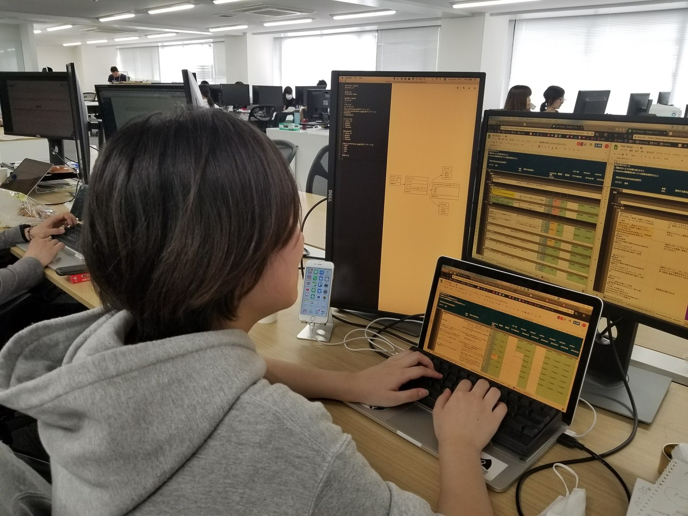

# コーディングとは無縁だった私がテストエンジニアインターンとしてReproにいる理由

## 縁としか思えないReproとの出会い

私は日本大学芸術学部で音響技術を専攻している学生です。大学に面白い先生がいて、個人で作ったアプリにReproのツールを導入し、活用していました。授業でのReproの話が記憶に残っていたからか、アルバイトを探しているときにたまたま掲載されていたReproの求人情報が目に飛び込んできました。気になってReproの情報をインターネットで検索し、CEO平田祐介（インタビュー記事）、VPoE三木明のインタビュー記事などを読んでいくうちにどんどん興味がわき、「この人達に会ってみたい」と思い立ちました。アルバイトのつもりで応募しましたが、面談を経てインターンとして採用されることになりました。

## ビジネスサイドから開発サイドへ

Repro入社後はCRM（カスタマーリレーションシップマネジメント）チームに所属し、クライアントのアプリを成長させるためのデータ分析や資料作成、アプリ改善施策の検討などをしていました。同じチームの社員の仕事ぶりがとてもかっこよく、ずっと背中を見続けていました。クライアント先に赴く前の準備の徹底ぶりや商談時の瞬発力、他メンバーからの提案や意見を受け入れすぐに実行するスピード感。自分の信念を強く持った社員やインターン生が多く、刺激の多い毎日でした。

そんな日々の中でどこかCRMチームでの業務が自分には向いていないのではないかと感じ始めていたとき、たまたま社内ワークショップがあり、「Repro」の管理画面に触れる機会がありました。そこでの経験がとても楽しく、「Repro」そのものに関係する仕事をしてみたくなり、すぐに開発サイドへの異動を希望しました。

## 「自分に向いている」ReproでのQAテスト業務

異動したいという希望が通り、QA（品質保証）チームへの異動となりました。QAチームの主な業務は、新たに開発された機能などのテストをし、品質を担保することです。

QAチームに入るまではコーディングやロジックなどと全く無縁だったため、VPoE三木から勧めてもらった本や、社内で共有されているエンジニアブログなどを読み、「Repro」がどのように作られているのかなどの全体像を掴むところから勉強を始めました。社内のエンジニアの発する単語がわからず、会話にもついていけなかった私が今もテストエンジニアを続けられているのは、業務内容と職場環境が自分に合っていたからだと思っています。

どこまでも疑って細かいミスを見逃さないテストエンジニアの業務は、私のとても慎重な気質と相性が良いです。エンジニア業務の性質として、コードの間違いがあればバグとして返ってくるし正しければ正常に動くという、明確な反応がすぐに得られる感覚も白黒はっきりさせるのが好きな私にはピッタリです。また、エンジニアの仕事は成長の実感が得られやすい業務でもあると感じています。PCの環境設定をアレンジしたり、キーボードのショートカットを覚えたりするなど、自分の仕事がやりやすくなるように環境構築していくことで、普段の業務がどんどん効率的になり、地道に自分が成長できていることがわかる日々はとても楽しいです。

そして、Reproにはすぐに相談できる環境があります。業務で行き詰ったときには、社内で共有されているブログを見れば疑問を解決できることが多いです。ブログを見ても解決しなかったことはチームのメンバーに質問をすればすぐに教えていただけます。時にはチーム内では解決しない問題にぶつかることもあり、そういった場合はその分野を専門としているチームのメンバーへ相談をします。疑問が疑問で終わらず、問題点があればすぐに指摘してもらえる環境があってこそ、ゼロスタートだった私がここまで成長できたのだと思っています。

## 大学卒業後はReproの社員になります！
Reproでインターンを始めてほどなく、就職活動も並行して行っていました。なかなかピンとくる会社に出会えず悶々としていた時期にCRMチームからQAチームへの異動が叶いました。

QAチームでのテスト業務にのめりこんでいくうちに、「この先もReproで働きたい。ここでエンジニアになりたい」という気持ちが芽生えていることに気づきました。業務自体もそうですが、社員たちの個性の豊かさや、考え方や働き方を人に押し付けるのではなく個人を尊重し、「背中を見てついてこい」というスタンスがとても魅力に感じました。インターンでも社員と同じようなレベルのアウトプットを求められる厳しい環境ではありますが、やることをきっちりやっていれば服装や出勤時間も比較的自由とであるという点も、自分らしくストレスなくインターンを続けられている理由だと思っています。

大学卒業後はReproの社員として働くことになりました。卒業までは学業もきちんとこなしつつ、「Repro」に関する疑問がなくなるよう勉強していきます。エンジニアの勉強を続けていると新しい機能を作りたいという野望も湧いてきますが、作る以前にまずは人が書いたコードを読めるようにならなくては、と考えています。

テストエンジニアという自分にとことん合った仕事にReproで出会えた私は、とても幸運だと思っています。
